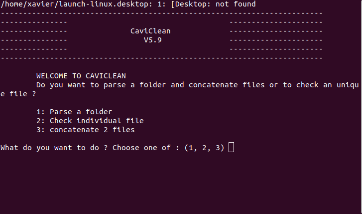

# CaviClean

Python package CaviClean for cleaning and agregating cavit files from separated folders

  

## How to install ?

Download the last version from github

>
> git clone https://github.com/xbouteiller/cavitron.git
>
> python setup.py develop
>

  

## How to use ?

In the **exec folder**:

- double clic on : **launch.bat**
- should be located in the same folder than caviclean-python-exec.py

  

## What are the possibilities ?

3 choices are offered at the beginning of the program

### Parse a folder and subfolders
- automatically detect raw files from cavitron within each subfolder
- check the coherence of files within each subfolder
- finally concatenate all files

### Check and correct an individual file already made by the program
- useful if we want to inactive individuals, change some columns values (e.g. treatement) 

### Concatenate 2 files
- typically if we want to add a new population to the database
	

  
	
## What do the program ?

1. Detection of error within several columns (e.g. typos)
	- if potential errors are detected, several options are proposed to the user to correct them	

2. Concatenation of files

3. Assert if each cavit number corresponds to an individual
	- based on the comination of several columns (campaign name, species, treatment, repetition, tree number - sample ref 2 -)
	- if a problem is detected several options are available (do nothing, automatically compute repetition number, change a column value, inactive individual)
	

  

## Important 
	
sample ref 1 - cavitron number - can never be changed by the program