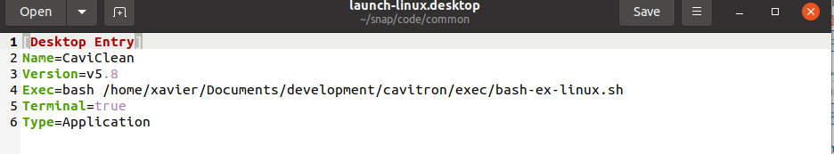
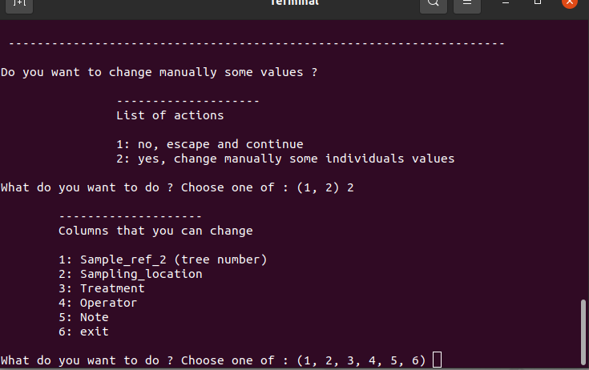

# CaviClean

CaviClean is a command line software made with Python for cleaning and agregating cavit files from separated folders

Current version is: **6.01**

  

## How to install ?

Download the last version from github

>
> git clone https://github.com/xbouteiller/cavitron.git
>
> python setup.py develop
>

  

## How to use on windows ?

In the **exec folder**:

- double clic on : **launch.bat**
- should be located in the same folder than caviclean-python-exec.py

or see step 1 in the program flow section below for more information.

  

## What are the possibilities ?

3 choices are offered when the program starts

### 1. Parse a folder and subfolders
- automatically detect raw files from cavitron within each subfolder
- check the coherence of files within each subfolder
- finally concatenate all files

### 2. Check and correct an individual file already made by the program
- useful if we want to inactive individuals, change some columns values (e.g. treatement) 

### 3. Concatenate 2 files
- typically if we want to add a new population to the already made database
	

  
	
## What do the program ?

1. Detection of error within several columns (e.g. typos)
	- if potential errors are detected, several options are proposed to the user to correct them	

2. Concatenation of files

3. Assert if each cavit number corresponds to an individual
	- based on the comination of several columns (campaign name, species, treatment, repetition, tree number - sample ref 2 -)
	- if a problem is detected several options are available (do nothing, automatically compute repetition number, change a column value, inactive individual)
	

  

## Program flow

Detailled flow for the method 1, other methods are very similar but are useful to check an alrealdy created file or to merge two cavitron files.

### 1. Parse a folder and subfolders

The program works on raw files edited by the cavisoft program. The name of the columns should not have been modified. For better integration, it is excepted that for each population (i.e. a set of files within the same folder), the cavitron number (sample ref 1) be unique. The sample ref 2 must correspond to the number of the tree. In case of several measures was conducted on the same individual, the program will propose to add a repetition in a neww column called REP.

#### Step 1

1. Change the path to the python script **caviclean-python-exec.py** in the file **launch.bat** file if you are on windows, or in the **launch-linux.desktop** file if you are on linux, then double click on it, the program should be executed in a console. (In linux, it can be necessary to allow execution of desktop files before).

#### Step 2

2. The program ask to chose a folder that will be parsed including its subfolders

#### Step 3

3. A method for detecting cavitron's files must be chosen. There is two possibilities : either the program detect files' name containing both a number and .csv extension nor the program detect files containing the string "cavisoft" in the first row. Number of detected files within folder and subfolders will be printed in the console.

#### Step 4

4. The program looks for errors or inconsistency within several columns. If a potential problem is detected, the program propose some action in order to fix it.

For example here, the program has detected 3 differents values for the treatment column : adult, young and empty values (nan). It seems that someone forgot to fill the column for at least one individual, so it is possible to fix the problem by modifying empty value with a new value (choice 2) or to erase the empy rows (choice 4). Independant choice of action can be made for each individual containing nan. Other typos (e.g. on adult or young) could have also been fixed in this step by selecting more values to modify.

#### Step 5

5. The program ask if we want to modify inactive manually some invdividuals. By convention, inactivated individuals are reported with a 'yes' in the Note column. To inactive individuals, you must provide the identifiant (i.e. cavitron number, sample ref 1).

#### Step 6

6. It is possbile to access and modify manually individual values within a broad choice of columns if needed. To modify individual values, you must provide the identifiant (i.e. cavitron number, sample ref 1).

#### Step 7

7. The program creates a REP column (for repetition) if it isn't exist with a value of 1 by default then its check the unicity of the individuales. Each individual must correspond to an unique combinaison of campaign name, sampling location, species, treatment, tree number and repetion must correspond to an unique individual. if duplicated individuals are detected the program propsoe several option to fix it. For example it is possible to compute repetition numbers with different values for each duplicated individual.

Please note that this step can be long for large dataframe as every pairwise combinaisons are assessed.

#### Step 8

8. Lastly, the program provide a summary of the data frame and then propose to save the data frame.

  

## Important 
	
sample ref 1 - cavitron number - can never be changed by the program